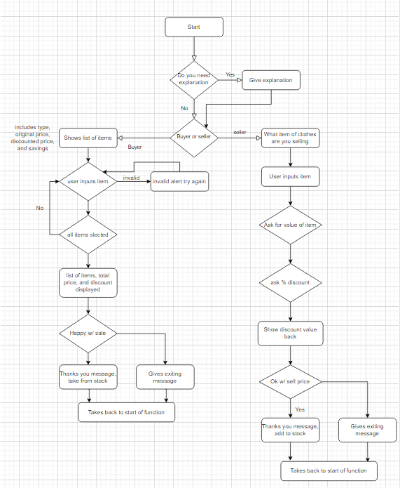

# Pre-Loved Pieces

Pre-Loved Pieces is a program that is aimed at people who have are looking to buy and sell pre-owned items of clothing. It
aims to be a useful tool to display items to buyer to select and calculate there savings, and for sellers to be able to post
their items and work out what the percentage savings are.

It is ultimately designed to be an easy to understand system for buying and selling clothes.

# Design

In this section I will cover the overall design choices of this project.

## Design goals

The overall goal with the design of this project is to make it clear and easy to follow, with clear instructions for the user.
I also wanted to give feedback to the user throughout to make sure they are making the correct inputs.

## Tools

This project was done entirely in Python

## Layout

This project has to have a clear layout, where the user can clearly see what they have to do to progress the program. It is
also layout out to give each piece of information enough space to be clearly visible without looking cluttered.

## Colour Scheme

The colour for this project is naturally black and white, however, I have added some red colour to the incorrect input messages
and some green colour to the outputs that tell the user their savings. Both were done using Colorama.

# Features

In this section I will be covering the various features I have implemented, who I had in mind when creating them, and why they are useful. This project has 2 different paths depending on what the user selects, and different ways to complete the paths and exit earlier.

The structure of the buyers path is that the user is given a list of items to select that appear in a grid. Each item has
a numeric value that the user must pick and then be prompted if they would like to make another selection. The user is also able
to break out of this loop by entering 0. Once the user has selcted all the items the system will display them back and show the
total value as well as the total savings. The user is then given the option to accept or decline. Both options take the user
out of the system, but if they accept the items are taken from the spreadsheet and how much they saved is displayed back.

The structure of the seller path 

# User Stories

- User Story 1: First impression of system functions.
- As a new user, I am looking to buy or sell clothing, I want to see clear instructions on how to navigate the system.

- User Story 2: Buying items.
- As a user, I want to be able to view the buyable items and be able to select them easily.

- User Story 3: Pricing.
- As a user, I want to be able to see the price of all the items and what my total savings will be.

- User Story 4: Selling items.
- As a user, I want to be able to input my sales item and percent discount and have the system work out the maths for me.

- User Story 5: Confirming sale.
* As a user, I want to be able to confirm what I'm selling and get feedback on how much money I'll make.

# Flowchart 

Please see attached flowchart for the systems logic.

# Navigation Bar

- The navigation bar and logo

* Featured on all six pages, the navigation bar which will always appear at the top of the page features a link to the home page, a link to the tricks page, one to the faq page, and one for the contact page.
* This was created to help the user flow of the website and allow the user to jump between each section at will without having to rely on back commands from the browser. The logo also acts as a home button if the user would like to use that.
* When on a page, the nav bar will have an underline to show the user which specific page they are on. When hovering over a new page the colour will also change to the baby blue contrast colour that matches the pages theme.

# Hero Image and text

- Hero image and text

* The hero image was designed to make the introduction the website instantly recognisable.
* The image is pair of skates with a brief description of what the page is about, so that the user does not question the purpose of the website.
* the image also has a zoom in animation for style.

# About Section

- What Skate Friendly is all about

* This is the first piece of information that will be displayed under the landing image. This section is broken up into 3 smaller sections aligned horizontally to that will explain why the group exists, and some of the benefits of skating.
* This clearly shows the user what the group can offer and why they might be interested in joining.

# Meetup Section

- The meetup section

* This section is intended to show the user the location, times, and days of our meetups.
* They have been designed to have a bakground image that displays the type of environment that they will be skating in. This was chosen as I felt it would be visually appealing and make the design more distinct.

# Footer

- Footer section

* The footer section will be appearing on all the pages. This has been designed with a minimal approach, using links that will take you to social media pages. I have not created social media pages for each of these so the link will guide to the home page of each website.

# Tricks Image

- Intro image for Tricks

* The intro to the tricks page is a new image of a pair of skates.
* The zoom effect has also been applied here.

# Tricks Page Content

- Content for the Tricks page

* The page opens with a styled desription of the page. It is clear what this page is for based on decription.
* Following this are 3 seperate sections describing different trciks as well as having a video underneath them to act as a tutorial.
* None of these videos play automatically and also have a volume control slider.

# FAQ Page Photo

- Main Image on FAQ page

- Similar to the other images, I felt this image captured the energy of the website.
- This also has a zoom effect applied.

# FAQ Content

- FAQ section

- This section was designed to answer any questions the user may have when getting into skating.
- It includes plenty of basic information as well as a link to the contact page which keeps you in the same tab.

* In this section there are 3 column sections similar in design to the home page to break up the information in an easy digestible way for the user.

- Safety

- This section was designed to explain to users best safety practice, along with including a link that open in another page to buy safety gear.

- Equipment content

- This section goes over the various equipment needs of a new skater such as skates, wheels, and accessories.

# Contact Page

- Main image for page, this image has a smiling woman, I chose this as it is inviting and would suit a contact page. This also features the zoom effect.

- The contact form was designed to take the users name, surname, and email.
- Styling this I decided to use a clear border and have the border be visible through a shadow effect, I chose this as I felt it was a more unique design.
- I then added a radio dial button for users to select their level of experience.
- I then made a submit button, this button was designed with rounded edges and to change colour when hovered over.
- It also gets a cursor when hovered over to let the user know it is able to be clicked.
- All parts of the form are required to be filled before you can submit.

* Once you complete the form and submit, you are redirected to a thank you site.

# Thank you page

- The thank you page is a redirect from the submission form, it is a simple page displaying a thank you message that will redirect you back tot he home page after 10 seconds.

# 404 Error page

- A simple 404 page with basic styling to tells the user they have ended up on a page that doesn't exist. It has an explanation and reedirects back to the home page after 5 seconds.

# Testing

- Ran html through W3C validator, have gotten back no errors but have gotten back 'warnings'. These warning are due to use of h1 elements in parts of the page that are not the very top. Due to time constraints, I am not able to change this right away as there is a lot of styling applied. If I were to re do the project, I would keep this in mind for future

* ran through Jigsaw css checker, no issues.

* I have checked screen compatibility for phone and tablet, I have checked tablet by using the inspect tool and shrinking down to size and have tested on my own personal mobile to assure it is responsive.

# Bugs

Throughout the project I had encountered several bugs which I will give details of in this section.

Resolved bugs:

- An issue I encountered was when developing my FAQ page. After designing it the footer was going up the page vertically and not horizontally at the bottom. I assumed it must be an issue with HTML and not CSS as it was unique to this page. After scanning through, I noticed I had left a tag unclosed, trying this brought most down to horizontal level, but not all. Then I noticed the entire thing was in one big section. When breaking it off into smaller one the issue had resolved.
- An issue I had encountered when making my page responsive was with my logo. I had it floated to the left and then pushed out with padding to the center. This looked good on desktop but not on other screen sizes. I had initially tried using a flex command to fix this but without much success. I ultimately decided to keep it floated to the left with a small amount of padding as this fixed the issue and made it look good on multiple screen sizes.
- Another bug I came across when when I was adding in my background images for the hero image. I was not able to get this to fit inside the the area I wanted to without looking distorted. After trying to alter the sizing, I used a larger image and a cover command which resolved the issue.
- I also encountered a bug when attaching the youtube videos to the tricks page. Initially were not loading correctling and I was unsure why. After having a look online, I realised I was using incorrect tags. When changed to iframe tags this then worked correctly.

Unresolved bugs:

- A bug I have left uncorrected is on the contact page. The styling shows shadowing on the desktop version but when I checked on the mobile this effect does not appear. I have tried to address this by increasing the shadow effect and this has not worked. Due to time constraints I was not able to find an alternative but I will update in future to something that is compatible with ios

- Another bug left uncorrected was the performance of the pages on mobile screens. I researched how to fix this and came across lazy loading. This solution looked like it would fix the issue how ever it would require JavaScript and I wanted to stick to html and css for this project.

# Lighthouse Testing

# Full Testing

The following devices were used during testing:

Desktop:

- Acer Aspire 5 17" screen

Tablet:

- iPad Air
- iPad Mini

Mobile Devices:

- iPhone 12
- iPhone 12 Pro
- Samsung Galaxy S8+

The following browsers were used during testing:

- Google Chrome
- Safari

All features that are on multiple pages (eg. Logo, Nav bar, Social media links) will only show up as tested in the first page they appear on, but have been tested on all pages.

## Home page testing

<table>
    <tr>
        <th>Feature</th>
        <th>Expected Outcome</th>
        <th>Test</th>
        <th>Result</th>
        <th>Pass/Fail</th>
    </tr>
    <tr>
        <td>Logo</td>
        <td>When clicking logo takes back to home page</td>
        <td>Click logo</td>
        <td>Takes back to home page</td>
        <td>pass</td>
    </tr>
    <tr>
        <td>Nav bar highlight</td>
        <td>Hovered page on nav bar will change colour</td>
        <td>Hover over nav bar</td>
        <td>Changed colour</td>
        <td>pass</td>
    </tr>
    <tr>
        <td>Hero image animation</td>
        <td>Hero image will have a zoom effect on all screen sizes</td>
        <td>Reloaded page on different screen sizes</td>
        <td>Animation occured</td>
        <td>pass</td>
    </tr>
    <tr>
        <td>Social media links</td>
        <td>All social media links on footer take you to new tab of the indicated social media</td>
        <td>Click each link</td>
        <td>Social media opened in seperate tabs</td>
        <td>pass</td>
    </tr>
</table>

## Tricks Page Testing

<table>
    <tr>
        <th>Feature</th>
        <th>Expected Outcome</th>
        <th>Test</th>
        <th>Result</th>
        <th>Pass/Fail</th>
    </tr>
    <tr>
        <td>Auto play</td>
        <td>Videos do not autoplay when page is loaded</td>
        <td>Reload page and check videos</td>
        <td>Does not autoplay</td>
        <td>pass</td>
    </tr>
    <tr>
        <td>Volume tab</td>
        <td>Videos will allow user to control volume once clicked</td>
        <td>Start video and mute volume with a click or control with cursor</td>
        <td>Volume mutes or goes up/down as intended</td>
        <td>pass</td>
    </tr>
    <tr>
        <td>Pause button</td>
        <td>Video will be able to be paused at anytime</td>
        <td>Click center of video and button in bottom left corner</td>
        <td>Video paused</td>
        <td>pass</td>
    </tr>
    <tr>
        <td>Full screen</td>
        <td>Videos will allow you to go full screen</td>
        <td>Click full screen icon in bottom right corner</td>
        <td>Video appeared full screen</td>
        <td>pass</td>
    </tr>
</table>

## FAQ Page

<table>
    <tr>
        <th>Feature</th>
        <th>Expected Outcome</th>
        <th>Test</th>
        <th>Result</th>
        <th>Pass/Fail</th>
    </tr>
    <tr>
        <td>Link to contact page</td>
        <td>When click on the our Contact Page link will take you to contact form in same tab</td>
        <td>Click on our Contact Page link</td>
        <td>Opens contact page in same link</td>
        <td>pass</td>
    </tr>
    <tr>
        <td>Links to recommended products</td>
        <td>When clicking on any of the recommended products linked will take you to a new tab with products</td>
        <td>Click on all 4 of the different links</td>
        <td>Opens all links in new page with the correct product displayed</td>
        <td>pass</td>
    </tr>
</table>

## Contact Page

<table>
    <tr>
        <th>Feature</th>
        <th>Expected Outcome</th>
        <th>Test</th>
        <th>Result</th>
        <th>Pass/Fail</th>
    </tr>
    <tr>
        <td>Form must be complete before submitting</td>
        <td>Form does not allow you to proceed unless every section complete</td>
        <td>Click submit with some area not complete</td>
        <td>Does not allow you to continue</td>
        <td>pass</td>
    </tr>
    <tr>
        <td>Email tab</td>
        <td>Email section will not proceed unless an email address is entered</td>
        <td>Click on submit with my full name in the email tab</td>
        <td>Email tab asks me to put in an email address before proceeding</td>
        <td>pass</td>
    </tr>
    <tr>
        <td>Radio button</td>
        <td>Only one radio button option can be selected at a time</td>
        <td>Click one radio button and then click each one after, tried this with every combonation of button</td>
        <td>Does not allow me to have more than one clicked</td>
        <td>pass</td>
    </tr>
    <tr>
        <td>Submit colour change</td>
        <td>Submit button changed colour when hovered over</td>
        <td>Hover over submit button</td>
        <td>Colour of button changes</td>
        <td>pass</td>
    </tr>
    <tr>
        <td>Submit button cursor</td>
        <td>Submit button changes cursor when hovered over</td>
        <td>Hover over submit button</td>
        <td>Cursor changes</td>
        <td>pass</td>
    </tr>
</table>

## Thank You Page

<table>
    <tr>
        <th>Feature</th>
        <th>Expected Outcome</th>
        <th>Test</th>
        <th>Result</th>
        <th>Pass/Fail</th>
    </tr>
    <tr>
        <td>Redirect to home page</td>
        <td>When left on page for 10 seconds, you will be redirected to home page</td>
        <td>Load page and wait 10 seconds</td>
        <td>Redirected to home page</td>
        <td>pass</td>
    </tr>
</table>

## 404 Error Page

<table>
    <tr>
        <th>Feature</th>
        <th>Expected Outcome</th>
        <th>Test</th>
        <th>Result</th>
        <th>Pass/Fail</th>
    </tr>
    <tr>
        <td>Redirect to home page</td>
        <td>When left on page for 5 seconds, you will be redirected to home page</td>
        <td>Load page and wait 5 seconds</td>
        <td>Redirected to home page</td>
        <td>pass</td>
    </tr>
</table>

# Deployment

- This was deployed in Github, I had done this by going to the seeting of the project, going down to pages in the sidebar, selecting the main branch, and deploying.
- the link to view this is here: https://sean-obrien95.github.io/skate-friendly/

# Forking and Cloning

## Forking the Repository

- Navigate to the main page of the "skate-friendly" repository on GitHub.
- Click on the Fork button in the upper-right corner of the page.
- This will create a copy of the repository under your GitHub account.

## Cloning the Repository

- On your forked repository page, click on the Code button.
- Select the HTTPS option to clone the repository using a secure connection.
- Copy the URL that is shown, which will be https://github.com/sean-obrien95/skate-friendly.git
- Open a terminal on your local machine.
- Navigate to the directory where you want to clone the repository.
- Run the following command: git clone https://github.com/sean-obrien95/skate-friendly.git
- This will create a local copy of the repository on your machine.

# Credit

Colorama extension: https://pypi.org/project/colorama/ 
Tabulate extension: https://pypi.org/project/tabulate/ 

### I had learned some commands from the following websites

- Methods to restrict user inputs: https://stackoverflow.com/questions/63497109/how-to-restrict-useer-input-with-a-yes-or-no-question-python 
- How to use the enumerate function: https://www.w3schools.com/python/ref_func_enumerate.asp 
- How to delete and count rows on google sheets: https://stackoverflow.com/questions/14625617/how-to-delete-remove-row-from-the-google-spreadsheet-using-gspread-lib-in-pytho 
- How to use isdigit function: https://www.w3schools.com/python/ref_string_isdigit.asp 
- How to use round function: https://www.w3schools.com/python/ref_func_round.asp 
- Commands used for Tabulate and Colorama are linked in the above credit section.