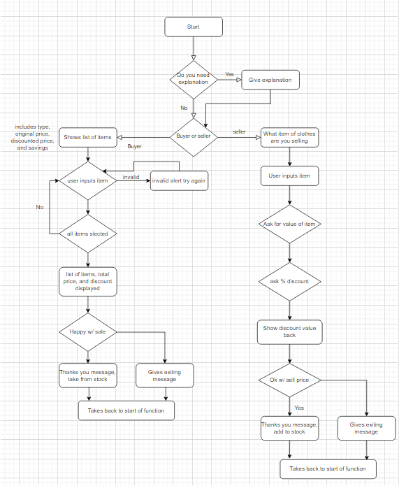
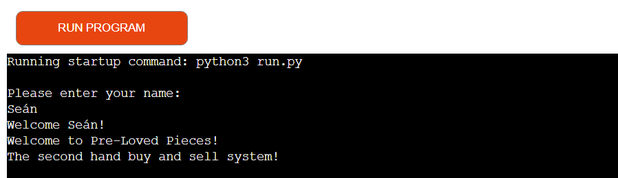

# Pre-Loved Pieces

Pre-Loved Pieces is a program that is aimed at people who have are looking to buy and sell pre-owned items of clothing. It
aims to be a useful tool to display items to buyer to select and calculate there savings, and for sellers to be able to post
their items and work out what the percentage savings are.

It is ultimately designed to be an easy to understand system for buying and selling clothes.

# Design

In this section I will cover the overall design choices of this project.

## Design goals

The overall goal with the design of this project is to make it clear and easy to follow, with clear instructions for the user.
I also wanted to give feedback to the user throughout to make sure they are making the correct inputs.

## Tools

This project was done entirely in Python

## Layout

This project has to have a clear layout, where the user can clearly see what they have to do to progress the program. It is
also layout out to give each piece of information enough space to be clearly visible without looking cluttered.

## Colour Scheme

The colour for this project is naturally black and white, however, I have added some red colour to the incorrect input messages
and some green colour to the outputs that tell the user their savings. Both were done using Colorama.

# Features

In this section I will be covering the various features I have implemented, who I had in mind when creating them, and why they are useful. This project has 2 different paths depending on what the user selects. Before the path the user must also input a username.

The structure of the buyers path is that the user is given a list of items to select that appear in a grid. Each item has
a numeric value that the user must pick and then be prompted if they would like to make another selection. Once the user has selcted all the items the system will display them back and show the total value as well as the total savings. The user is then given the option to accept or decline. If the user accepts, the items are then removed from the spreadsheet and they are given
feedback telling them it is successful. If they decline, the items are not removed. After either option, they are given the option
to continue using the system to buy or sell, or exit.

The structure of the seller path is that the user is prompted to input an item name, an original value, and then the percent
they would like to discount it by. After they have done this, they will be displayed all this information back as well as a new discounted value that is calculated by the system. After this, they will be given the option to confirm sale or decline.
If they confirm, the item is then added to the spreadsheet. If they decline it is not updated. Both options will give the user
the option to start the program again afterwards.

# Future Features

There is one feature that I have not implemented that I would like to add at a later stage. This feature is to make the items already selected not appear on the buyer path when the user goes to select another item. I decided not to implement this yet as I felt it would be beyond my current knowledge to be able to make them not appear, or temporarily remove them from the list.

# User Stories

- User Story 1: First impression of system functions.
- As a new user, I am looking to buy or sell clothing, I want to see clear instructions on how to navigate the system.

- User Story 2: Buying items.
- As a user, I want to be able to view the buyable items and be able to select them easily.

- User Story 3: Pricing.
- As a user, I want to be able to see the price of all the items and what my total savings will be.

- User Story 4: Selling items.
- As a user, I want to be able to input my sales item and percent discount and have the system work out the maths for me.

- User Story 5: Confirming sale.
* As a user, I want to be able to confirm what I'm selling and get feedback on how much money I'll make.

# Flowchart 

Please see attached flowchart for the systems logic. Below I will describe each section of the chart in detail

## Start

- The first step of the system logic

* In this section the user will be asked to input their username. I have restricted this to be less than 10 characters and can
only apply letters. I decided this as I did not want names that were too long for the console to display.
* I created this using classes and while loops.
* After input the user will be welcomed, and the username data will be stored and used later in the program.

## Instructions

- Instructions logic

* In this section the user will be asked if they want instructions.
* They are given an option of yes or no (y/n), whether they click y or n will determine the print statement that is given back,
y will give a brief explanation and n will not. They do not take other inputs. This is achieved with a while loop.
* Both options will bring the user to the next stage.

## Buyer or Seller

- Option used for determining which route the user will be taken down.

* This is a simple function that requires the user to input if they are a buyer or seller (b/s).
* Which option the user selects will determine which route they will be taken through the system.

## Shows list of Items

- The first piece of logic after slecting buyer

* This section is the first thing the user will ancounter as a buyer.
* The data of the items will be retrieved from the google doc, including items, original price, ddiscount percent, and price
after discount.
* These items are displayed in a table and assigned an index number.
* The table was created using Tabulate extansion.

## User inputs item

- Logic used for selecting an item.

* The user will be asked to input a valid index number.
* If the user inputs an invalid number, they will be prompted to enter again.
* After entering a valid number, they will be asked if they would like to make another selection (y/n)
* If they select yes, they will be shown the list and asked for a valid index again.
* If they select and already selected item they will be told that it is already selected and asked if they would like to select another item again. The logic to handle if the item is selected is made using a for loop.
* They will be broken out of the loop when the select no when prompted if they would like to select another item, or if they have selected every item available.

## Confirming Purchase

- The final pieces of logic following the buyer path

* Once the user has broken out of the above loop, all the items they have selected will be displayed back to them, showing the item, the discounted price, and how much they will be saving.
* They are then given the option to accept or decline (y/n).
* If the user acceptes, the amount they saved and their name will be displayed with a thank you message. The selected items will also be removed from the list. This is done using by sorting them and using a for loop.
* If the user declines, the items will not be removed.
* After either option, the user is asked if they would like to buy/sell another item. If they select yes, they are taken back up to the buy or sell stage of the logic. If they decline, the system exits.

## Seller Item Details

- Logic for selling an item

* If the user enters the seller path by selecting s, the first piece of logic they come to will be to get the item details.
* They will be asked to give a description of the item. This will be limited to only alphabetical items and under 10 characters long. I decided this as items would not need a numeric value and to keep the item name shorter so that it fits within the terminal.
* After this, they will be aksed to input the original value of the item. This is limited to be between 1 - 999 and must be an integer. My reason for deciding this is that I felt using integers would be easier to work with and more appealing to the user.
* They will then be asked for a percent dicount. This has to be between 1 - 99 and also must be an integer.
* The item is then displayed back with description, original value, and the new value with the discount applied. This is done using a simple equation on in the code, and will uses a round feature again to keep the number as an integer.

## Confirming Sale

- Final piece of logic along the sellers path.

- This section of logic will ask the user if they would like to confirm sale (y/n)
- If the user accepts, the item will be added to the spreadsheet using by appending the row.
- If the user declines, the sheet will not be updated.
- The user is then asked if they would like to buy or sell another item, similarly to the confirm purchase logic.
- If they select yes, they will be taken up to buyer or seller section, and if they select no they will exit the system.

# Testing

- Ran script through Code Institue Python validator (pep8 heroku app) with no issues. Only thinf to be flagged is the use of # noqa for the else statement on line 291. This was used here as the line could not be split up and still functional.

# Bugs

Throughout the project I had encountered several bugs which I will give details of in this section.

Resolved bugs:

- An issue I encountered was when I had developed the buyer path. I had developed the the list to be appear and after the buyer had selected to pick another item it would allow them to pick the same item twice. This was caused by the code not checking if the item was already selected by the user. This was resolved with a for loop.
- An issue I had encountered was that after the purchase was confirmed, the item that was getting deleted from the spreadsheet was incorrect, and deleting the one above the intended one. This was caused due to the index difference in google spreadsheets and python. I had adjusted for index differencing in other parts of the code so did not need to do this again. I changed my -1 to a +1 on line 200 and this resolved the issue.
- Another bug I came across when I had added in the table. After deployment, the table was coming out in an odd way and seemed to be overlapping with itself. After investigating I realised that this was due to the titles for each column being too long. Once shortened, it was working as intended.

Unresolved bugs:

- There is one unresolved bug in the system that I am aware of. This bug is found if you enter the buyer path and the list of items is empty. The bug will allow show still take the user to the purchase section even though there is no items selected. If the user selects confirm or decline nothing will happen other than the usual print statements and being asked if they would like to buy/sell again. I left this unresolved as it ultimately did not effect anything and in order to get rid og it I would have to make an entirely new function that seperates the purchase from the buy or sell again section.
- Something else worth mentioning is the user input for the selling items section. The user is prompted to enter an item however there is no restriction on what they type, for example, they could type car, toy, their name etc. I am aware of this but had decided not to edit it. My reason is that I would have to make a list of predermined options for the user to select from and I felt this was too restrictive so decided to leave this as is.

# Full Testing

The following devices were used during testing:

Desktop:

- Acer Aspire 5 17" screen

The following browsers were used during testing:

- Google Chrome

## Home page testing

<table>
    <tr>
        <th>Feature</th>
        <th>Expected Outcome</th>
        <th>Test</th>
        <th>Result</th>
        <th>Pass/Fail</th>
    </tr>
    <tr>
        <td>Logo</td>
        <td>When clicking logo takes back to home page</td>
        <td>Click logo</td>
        <td>Takes back to home page</td>
        <td>pass</td>
    </tr>
    <tr>
        <td>Nav bar highlight</td>
        <td>Hovered page on nav bar will change colour</td>
        <td>Hover over nav bar</td>
        <td>Changed colour</td>
        <td>pass</td>
    </tr>
    <tr>
        <td>Hero image animation</td>
        <td>Hero image will have a zoom effect on all screen sizes</td>
        <td>Reloaded page on different screen sizes</td>
        <td>Animation occured</td>
        <td>pass</td>
    </tr>
    <tr>
        <td>Social media links</td>
        <td>All social media links on footer take you to new tab of the indicated social media</td>
        <td>Click each link</td>
        <td>Social media opened in seperate tabs</td>
        <td>pass</td>
    </tr>
</table>

## Tricks Page Testing

<table>
    <tr>
        <th>Feature</th>
        <th>Expected Outcome</th>
        <th>Test</th>
        <th>Result</th>
        <th>Pass/Fail</th>
    </tr>
    <tr>
        <td>Auto play</td>
        <td>Videos do not autoplay when page is loaded</td>
        <td>Reload page and check videos</td>
        <td>Does not autoplay</td>
        <td>pass</td>
    </tr>
    <tr>
        <td>Volume tab</td>
        <td>Videos will allow user to control volume once clicked</td>
        <td>Start video and mute volume with a click or control with cursor</td>
        <td>Volume mutes or goes up/down as intended</td>
        <td>pass</td>
    </tr>
    <tr>
        <td>Pause button</td>
        <td>Video will be able to be paused at anytime</td>
        <td>Click center of video and button in bottom left corner</td>
        <td>Video paused</td>
        <td>pass</td>
    </tr>
    <tr>
        <td>Full screen</td>
        <td>Videos will allow you to go full screen</td>
        <td>Click full screen icon in bottom right corner</td>
        <td>Video appeared full screen</td>
        <td>pass</td>
    </tr>
</table>

## FAQ Page

<table>
    <tr>
        <th>Feature</th>
        <th>Expected Outcome</th>
        <th>Test</th>
        <th>Result</th>
        <th>Pass/Fail</th>
    </tr>
    <tr>
        <td>Link to contact page</td>
        <td>When click on the our Contact Page link will take you to contact form in same tab</td>
        <td>Click on our Contact Page link</td>
        <td>Opens contact page in same link</td>
        <td>pass</td>
    </tr>
    <tr>
        <td>Links to recommended products</td>
        <td>When clicking on any of the recommended products linked will take you to a new tab with products</td>
        <td>Click on all 4 of the different links</td>
        <td>Opens all links in new page with the correct product displayed</td>
        <td>pass</td>
    </tr>
</table>

## Contact Page

<table>
    <tr>
        <th>Feature</th>
        <th>Expected Outcome</th>
        <th>Test</th>
        <th>Result</th>
        <th>Pass/Fail</th>
    </tr>
    <tr>
        <td>Form must be complete before submitting</td>
        <td>Form does not allow you to proceed unless every section complete</td>
        <td>Click submit with some area not complete</td>
        <td>Does not allow you to continue</td>
        <td>pass</td>
    </tr>
    <tr>
        <td>Email tab</td>
        <td>Email section will not proceed unless an email address is entered</td>
        <td>Click on submit with my full name in the email tab</td>
        <td>Email tab asks me to put in an email address before proceeding</td>
        <td>pass</td>
    </tr>
    <tr>
        <td>Radio button</td>
        <td>Only one radio button option can be selected at a time</td>
        <td>Click one radio button and then click each one after, tried this with every combonation of button</td>
        <td>Does not allow me to have more than one clicked</td>
        <td>pass</td>
    </tr>
    <tr>
        <td>Submit colour change</td>
        <td>Submit button changed colour when hovered over</td>
        <td>Hover over submit button</td>
        <td>Colour of button changes</td>
        <td>pass</td>
    </tr>
    <tr>
        <td>Submit button cursor</td>
        <td>Submit button changes cursor when hovered over</td>
        <td>Hover over submit button</td>
        <td>Cursor changes</td>
        <td>pass</td>
    </tr>
</table>

## Thank You Page

<table>
    <tr>
        <th>Feature</th>
        <th>Expected Outcome</th>
        <th>Test</th>
        <th>Result</th>
        <th>Pass/Fail</th>
    </tr>
    <tr>
        <td>Redirect to home page</td>
        <td>When left on page for 10 seconds, you will be redirected to home page</td>
        <td>Load page and wait 10 seconds</td>
        <td>Redirected to home page</td>
        <td>pass</td>
    </tr>
</table>

## 404 Error Page

<table>
    <tr>
        <th>Feature</th>
        <th>Expected Outcome</th>
        <th>Test</th>
        <th>Result</th>
        <th>Pass/Fail</th>
    </tr>
    <tr>
        <td>Redirect to home page</td>
        <td>When left on page for 5 seconds, you will be redirected to home page</td>
        <td>Load page and wait 5 seconds</td>
        <td>Redirected to home page</td>
        <td>pass</td>
    </tr>
</table>

# Deployment

# Forking and Cloning

## Forking the Repository

## Cloning the Repository

# Credit

Colorama extension: https://pypi.org/project/colorama/ 
Tabulate extension: https://pypi.org/project/tabulate/ 

### I had learned some commands from the following websites

- Methods to restrict user inputs: https://stackoverflow.com/questions/63497109/how-to-restrict-useer-input-with-a-yes-or-no-question-python 
- How to use the enumerate function: https://www.w3schools.com/python/ref_func_enumerate.asp 
- How to delete and count rows on google sheets: https://stackoverflow.com/questions/14625617/how-to-delete-remove-row-from-the-google-spreadsheet-using-gspread-lib-in-pytho 
- How to use isdigit function: https://www.w3schools.com/python/ref_string_isdigit.asp 
- How to use round function: https://www.w3schools.com/python/ref_func_round.asp 
- Commands used for Tabulate and Colorama are linked in the above credit section.